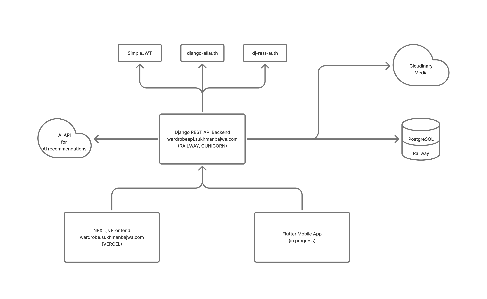

# Wardrobe by Sukhman

A full-stack wardrobe management application with AI-powered outfit recommendations. Built as a portfolio project and as applied learning context for a mobile development course, with a long-term goal of a "one API, multiple clients" architecture: a Next.js web frontend and a Flutter mobile app both consuming the same Django REST API.

**Live demo:** `https://wardrobe.sukhmanbajwa.com`
**API:** `https://wardrobeapi.sukhmanbajwa.com`

---

## Table of Contents

1. [Overview](#overview)
2. [Tech Stack](#tech-stack)
3. [Architecture](#architecture)
4. [Data Models](#data-models)
5. [API Reference](#api-reference)
6. [Authentication](#authentication)
7. [AI Recommendation System](#ai-recommendation-system)
8. [Frontend Architecture](#frontend-architecture)
9. [Deployment](#deployment)
10. [Key Technical Decisions & Challenges](#key-technical-decisions--challenges)
11. [Mobile App (In Progress)](#mobile-app-in-progress)
12. [Roadmap](#roadmap)

---

## Overview

Wardrobe lets a user catalog their clothing items with photos, organize them by category and tags, and receive AI-generated outfit pairing suggestions. Wardrobe, helps users to keep track of their clothing items, and get quick suggestions to pair them together.

**Core features:**

- Email/password and Google OAuth authentication
- Clothing item CRUD with Cloudinary-hosted image uploads
- User-scoped categories and tags
- AI-generated outfit recommendations, computed asynchronously on item creation
- Full-text search and category filtering across the inventory
- Settings panel for account, category, and tag management

---

## Tech Stack

| Layer                | Technology                                                              |
| -------------------- | ----------------------------------------------------------------------- |
| Backend framework    | Django 6 + Django REST Framework                                        |
| Database             | PostgreSQL                                                              |
| Auth                 | django-allauth + dj-rest-auth + SimpleJWT (httpOnly cookies)            |
| Media storage        | Cloudinary                                                              |
| AI provider          | Groq (Llama 3.3 70B) via a swappable provider abstraction and/or Gemini |
| Web frontend         | Next.js 16 (App Router) + React + TypeScript + Tailwind CSS             |
| Data fetching        | TanStack Query (React Query) v5                                         |
| UI components        | Headless UI v2                                                          |
| Mobile (in progress) | Flutter + Dart                                                          |
| Frontend hosting     | Vercel                                                                  |
| Backend hosting      | Railway (app + managed PostgreSQL)                                      |
| DNS                  | Cloudflare                                                              |
| Domain               | Namecheap-registered, Cloudflare-managed (`sukhmanbajwa.com`)           |

---

## Architecture



Both the web and (eventually) mobile clients talk to the same Django API, which is the single source of truth for data, auth, and business logic. This is the "one API, multiple clients" design goal.

---

## Data Models

### `user` app

**`User`**

- `Abstract user`
- `status (active/inactive)`
- `avatar_url` , nullable

### `wardrobe` app

**`Category`**

- `name` (max 20 chars)
- `user` — FK to `CustomUser`, `CASCADE`
- `unique_together`: `["name", "user"]` — categories are scoped per user

**`ClothingItem`**

- `name` (max 30 chars)
- `category` — FK to `Category`, `SET_NULL`, nullable
- `description` — `TextField`
- `image` — `ImageField` (Cloudinary-backed, `upload_to="clothing/"`, `max_length=500` for long Cloudinary URLs)
- `user` — FK to `CustomUser`, `CASCADE`
- `is_deleted` — `BooleanField`, default `False` (soft delete)

**`Tag`**

- `name` (max 10 chars)
- `source` — choice field: `ml` (machine-generated) or `user`
- `colour_hex` — nullable
- `user` — FK to `CustomUser`, `CASCADE`
- `unique_together`: `["name", "user"]`

**`ClothingItemTag`** (join table)

- `tag` — FK to `Tag`
- `item` — FK to `ClothingItem`

### `ai_recommendations` app

**`AiDescription`**

- `item` — `OneToOneField` to `ClothingItem`
- `description` — `TextField`

**`AiRecommendation`**

- `item` — FK to `ClothingItem`, `related_name="recommendations"`
- `recommended_item` — FK to `ClothingItem`, `related_name="recommended_by"`
- `reason` — `TextField`
- `best_match` — `BooleanField`, default `False`

---

## API Reference

Base path conventions: `/api/auth/*` for authentication (dj-rest-auth), `/v1/*` for application resources, `/v1/ai/*` for AI recommendation endpoints.

| Method           | Endpoint                           | Purpose                                                    |
| ---------------- | ---------------------------------- | ---------------------------------------------------------- |
| POST             | `/api/auth/login/`                 | Email/password login                                       |
| POST             | `/api/auth/logout/`                | Logout, clears cookies                                     |
| POST             | `/api/auth/registration/`          | Create account                                             |
| GET/PATCH        | `/api/auth/user/`                  | Current user details                                       |
| POST             | `/api/auth/password/change/`       | Change password                                            |
| POST             | `/api/auth/google/`                | Google OAuth code exchange                                 |
| GET/POST         | `/v1/clothing_items/`              | List / create items (supports `?search=` and `?category=`) |
| GET/PATCH/DELETE | `/v1/clothing_items/{id}/`         | Retrieve / update / soft-delete an item                    |
| GET/POST         | `/v1/categories/`                  | List / create categories                                   |
| PATCH/DELETE     | `/v1/categories/{id}/`             | Update / delete a category                                 |
| GET/DELETE       | `/v1/tags/`                        | List / delete tags                                         |
| GET              | `/v1/ai/ai_req/{item_id}/`         | Get saved recommendations for an item                      |
| GET              | `/v1/ai/ai_req_refresh/{item_id}/` | Regenerate recommendations for an item                     |

All application resource endpoints are scoped to `request.user` at the queryset level and protected by a custom `IsOwner` permission class that checks `obj.user == request.user` at the object level.

---

## Authentication

### Flow

The app uses **JWT stored in httponly cookies**, not `localStorage`, to reduce exposure to Cross-Site Scripting (XSS) vulnerability. `dj-res-auth` + `SimpleJWT` handle issuing and rotating tokens; `django-allauth` handles the underlying account/social-account model.

**Regular login:**

1. `POST /api/auth/login/` with username/password
2. Django sets `access-tocken` and `refresh-tocken` httponly cookies
3. Requests include cookies automatically (`credentials: "include"`) on every fetch.

**Google OAuth (Authorization code + PKCE flow):**

1. Frontend uses `@react-oauth/google`'s `useGoogleLogin` with `flow: "auth-code"`, which opens Google's consent screen in a popup and tells Google to send the result back via `postMessage` instead of a redirect
2. After the user approves, Google sends the authorization code back to the popup's opener window using `postMessage`
3. Frontend POSTs the code to `/api/auth/google/`
4. A custom `GoogleLogin(SocialLoginView)` view exchanges the code with Google — it must also say `callback_url = "postmessage"`, matching what was used in step 1, or Google rejects the exchange
5. Django creates/logs in the user and sets the same JWT cookies used by regular login

**Default categories on signup:**
A `post_save` signal on `CustomUser` creates a starter set of categories for every new user - chosen over overriding `perform_create` on the registeration view because signals fire consistently regardless of _how_ the user is created (regular signup or Social signups like Google OAuth, or any other methods).

### Cross-domain cookie configuration

(see [Key Technical Decisions](#key-technical-decisions--challenges)). The working production configuration:

```python
IS_PRODUCTION = env_config("IS_PRODUCTION", default=False, cast=bool)
DEBUG = not IS_PRODUCTION

REST_AUTH = {
    "USE_JWT": True,
    "JWT_AUTH_COOKIE": "access-token",
    "JWT_AUTH_REFRESH_COOKIE": "refresh-token",
    "JWT_AUTH_HTTPONLY": True,
    "JWT_AUTH_SECURE": IS_PRODUCTION,
    "JWT_AUTH_SAMESITE": "Lax",
    "JWT_AUTH_COOKIE_DOMAIN": ".sukhmanbajwa.com" if IS_PRODUCTION else None,
    "SESSION_LOGIN": False,
}
```

Locally during development, `IS_PRODUCTION` is `False`, so cookies are `SameSite=Lax`, non-`Secure`, no explicit domain - works fine over plain HTTP on `localhost`. In production, the frontend (`wardrobe.sukhmanbajwa.com`) and backend (`wardrobeapi.sukhmanbajwa.com`) are **subdomains of the same root domain**, `SameSite=Lax` with an explicit shared cookie domain (`.sukhmanbajwa.com`) works - this was the fix after third-party cookie blocking broke the original two-seperate-domain setup (Vercel's default domain + Railway's default domain). Allowed CORS origins and Allowed Host lists are also controlled by IS_PRODUCTION bool state.

---

## AI Recommendation System

### Provider adstraction

To avoid vendor lock-in and make cost/rate-limit tradeoffs easy to change, LLM calls go through an abstract interface:

```
ai_recommendations/
  llm_providers/
    base.py             # abstract LLMProvider class
    groq_provider.py     # GroqProvider(LLMProvider)
    gemini_provider.py   # GeminiProvider(LLMProvider)
  services.py             # orchestration, JSON cleanup, DB writes
```

`base.py` defines a contract every provider must satisfy:

```python
class LLMProvider(ABC):
    @abstractmethod
    def generate_recommendation(self, item_info, inventory_data, example):
        pass
```

`services.py` calls which ever provider `get_llm_provider()` returns. Can choose from what llm_providers avaiblable. Swapping LLM is one line change.

**Why Groq**
Groq offers access to various llm with exceptable rate caps. Groq came out much faster than Gemini flash 3.1 lite
Though, more api can be explored. Create class for LLM and use that in services -> get_llm_provider()

### Generation flow

1. When a new `ClothingItem` is created, a signal is used to start ai recommendation creation process.
2. A background thread calls, `Ai_Recommendation(item_info, inventory_data)`, which prompts the LLM to return a strict JSON: a `Good_match` array (item id -> reasoning) and a `Complete_outfit` array (ids that form a full outfit) (Complete outfit part is not used yet.).
3. Response text is scanned for the first `{` and last `}` to strip any markdown code-fencing some providers add arround JSON
4. Pardsed JSON is send via `Save_Ai_Recommendations`, which creates `AiRecommendation` rows and flags `best_match=True`(not used), for ids in `Complete_outfit`(not used).

### Manual refresh

Users can also trigger regeneration for a single item from the item detail view. This shares the same underlying generation function as the automatic on-create signal, rather than goign through Django's `call_command` machinery, so both paths stay in sync as the logic evolves.

### Bidirectional recommendation display

If item A is recommended alongside item B, viewing item B's detail page also surfaces item A — the API queries both directions (`item=X` and `recommended_item=X`) and de-duplicates by item id before returning results.

---
